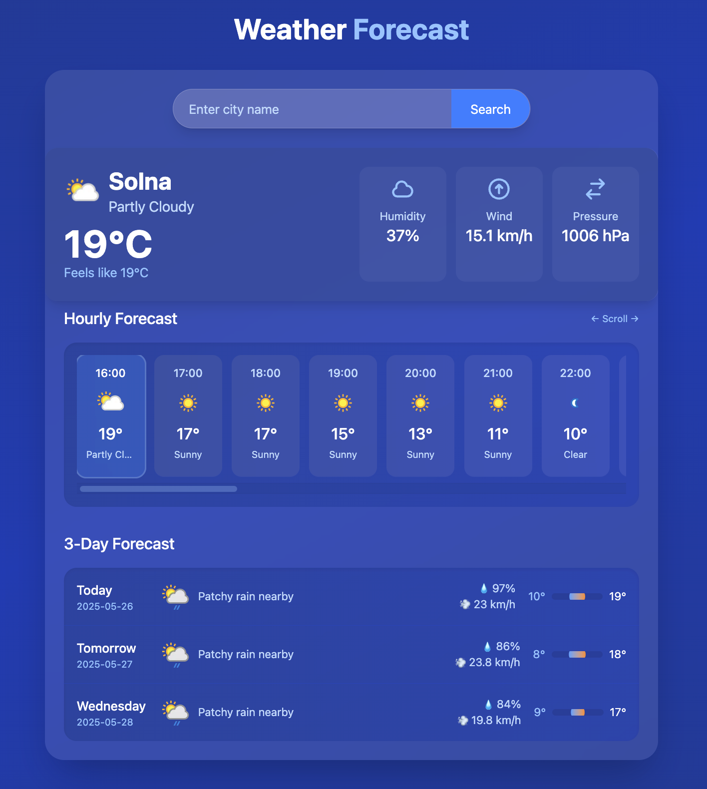

# Weather Forecast App

A modern weather application built with Node.js and React that provides current weather conditions and hourly forecasts.

## Features

- Current weather conditions display
- 24-hour forecast with scrollable interface
- City search functionality
- Automatic hourly updates

## Tech Stack

- **Frontend**: React, Tailwind CSS, Vite
- **Backend**: Node.js, Express
- **Package Manager**: pnpm

## Quick Start

### Prerequisites

- Node.js 16+
- pnpm

### Installation

```bash
# Clone the repository
git clone https://github.com/yourusername/weather_nodejs.git
cd weather_nodejs

# Install dependencies
pnpm install
```

Configuration

Create a .env file in the backend directory:

# backend/.env

PORT=3000

WEATHER_API_KEY=your_weatherapi_com_key

API_BASE_URL=https://api.weatherapi.com/v1

Run Application:

pnpm dev

Frontend: http://localhost:5173

Backend API: http://localhost:3000


